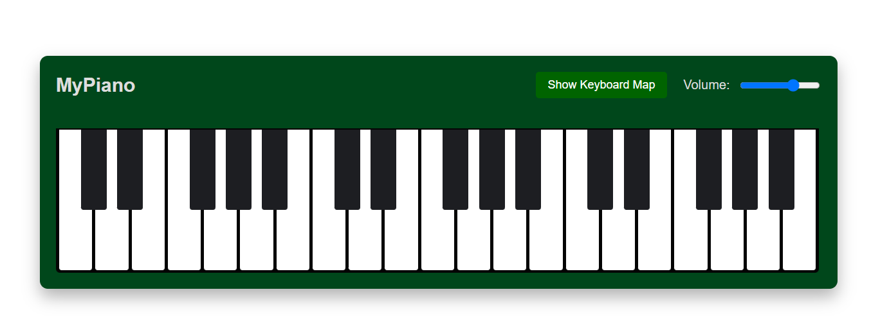

# 🎹 myPiano

A responsive, interactive virtual piano built with HTML, CSS, and JavaScript. Play using your mouse or your computer keyboard!

<p align="center">
  
</p>

🚀 **Live Demo**: [tikesh-sahu-git.github.io/myPiano](https://tikesh-sahu-git.github.io/myPiano/)

---

## 🎼 Features

- ✅ Interactive piano keys with real sound
- ✅ Keyboard controls (A, S, D... and W, E, T... for black keys)
- ✅ Volume control slider
- ✅ Toggleable keyboard mapping overlay
- ✅ Responsive design for desktops and tablets
- ✅ Smooth visual feedback and animations

---

## 🎮 Controls

- **White Keys**: A, S, D, F, G, H, J, K, L, ;, '
- **Black Keys**: W, E, T, Y, U, O, P
- **Mouse Click**: Play any key by clicking it
- **Volume**: Use the slider in the top-right
- **Toggle Key Map**: Click the *"Show Keyboard Map"* button

---

## 🛠️ Technologies Used

- HTML5
- CSS3 (with Flexbox and Media Queries)
- JavaScript (Vanilla)
- Sound samples from [gleitz/midi-js-soundfonts](https://github.com/gleitz/midi-js-soundfonts)

---

## 📂 Project Structure

```plaintext
myPiano/
│
├── index.html         # Main HTML structure
├── piano.css          # Styling for layout, keys, and responsiveness
├── piano.js           # Script for interactivity and audio logic
└── README.md          # Project documentation
